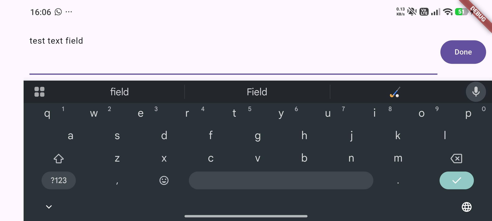

# OrientTextField
[](https://pub.dev/packages/orient_text_field)  [](https://saweria.co/hrlns) [](https://ko-fi.com/M4M81N5IYI)

A Flutter package that provides orientation-aware text field widgets. `OrientTextField` and `OrientTextFormField` are drop-in replacements for the standard `TextField` and `TextFormField` widgets with added support for landscape orientation and full-screen editing.



[](https://ko-fi.com/M4M81N5IYI)

## Features

- Drop-in replacement for `TextField` and `TextFormField`
- Automatic full-screen editing mode in landscape orientation
- Same parameters as standard Flutter text fields
- Keyboard visibility detection and management
- Seamless orientation handling

## Installation

Add this to your `pubspec.yaml`:

```yaml
dependencies:
  orient_text_field: ^0.1.0
```

Run:

```bash
flutter pub get
```

## Usage

### Setup

Wrap your app with `KeyboardStatusProvider` at the root:

```dart
import 'package:flutter/material.dart';
import 'package:orient_text_field/orient_text_field.dart';

void main() {
  runApp(const MyApp());
}

class MyApp extends StatelessWidget {
  const MyApp({super.key});

  @override
  Widget build(BuildContext context) {
    return KeyboardStatusProvider(
      child: MaterialApp(
        home: Scaffold(
          body: MyForm(),
        ),
      ),
    );
  }
}
```

`OrientTextField` and `OrientTextFormField` accept all the same parameters as Flutter's standard `TextField` and `TextFormField`. Simply replace your existing widgets without changing any parameters:

```dart
// Before
TextField(
  decoration: InputDecoration(labelText: 'Name'),
  maxLines: 3,
  keyboardType: TextInputType.text,
)

// After - Just change the class name
OrientTextField(
  decoration: InputDecoration(labelText: 'Name'),
  maxLines: 3,
  keyboardType: TextInputType.text,
)
```

**Note:** The `onTap` parameter is reserved for internal package functionality and is not available.

**Bonus:** For a cleaner layout when the keyboard is visible in landscape mode, add:

```dart
resizeToAvoidBottomInset:
  MediaQuery.orientationOf(context) == Orientation.portrait,
```

## FullScreenFieldConfig

Customize the full-screen editing mode with these options:

| Property | Type | Default | Description |
|----------|------|---------|-------------|
| `decoration` | `InputDecoration?` | null | Custom decoration for full-screen mode. |
| `keyboardAppearance` | `Brightness?` | null | Keyboard appearance (light/dark). If null, inherits from parent field. |
| `doneText` | `String` | "Done" | Label text for the done button. |
| `obscureText` | `bool?` | null | Override text obscuring for full-screen mode. If null, inherits from parent. |
| `withObscureToggle` | `bool` | false | Show visibility toggle button for obscured text. |
| `obscureEnabedIcon` | `Widget` | `Icons.visibility` | Icon shown when text is obscured. |
| `obscureDisabledIcon` | `Widget` | `Icons.password` | Icon shown when text is visible. |
| `enableFormValidation` | `bool?` | null | Enable validation in full-screen mode (only for `OrientTextFormField`). |

## Examples

For more complete examples including password fields, validation, and different configurations, see the `example` folder.

## Requirements

- Flutter: >=1.17.0
- Dart: >=3.11.4

## License

See LICENSE file.
